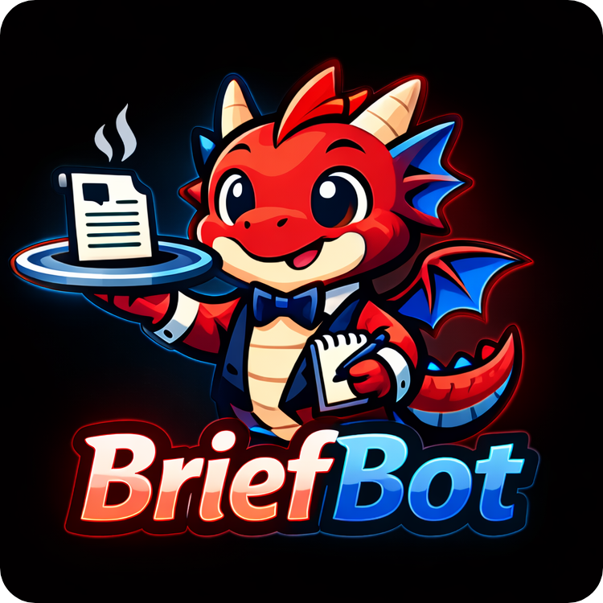
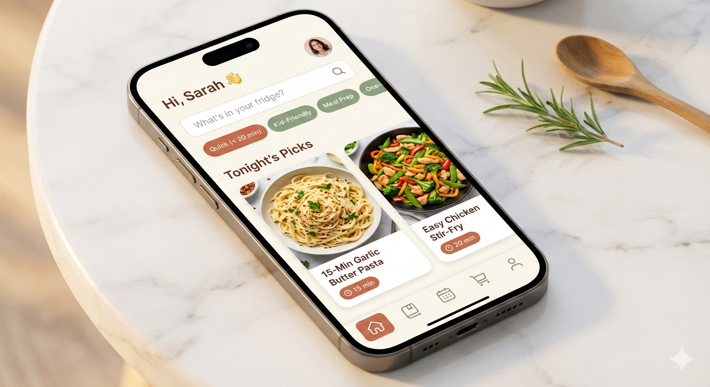

# BriefBot - ClaudeCode Skill

<div align="center" name="top">
  

<strong>Research any topic from the last N days across Reddit, X, YouTube, LinkedIn & the web</strong>
<i>Stay up to date in a world that's never moved faster!</i>

</div>

<p align="center">
  <a href="#-quickstart">Quickstart</a> •
  <a href="#-use-cases">Use Cases</a> •
  <a href="#-features">Features</a> •
  <a href="#-options">Options</a> •
  <a href="#-examples">Examples</a>
</p>

---

The AI world reinvents itself every month. This Claude Code skill keeps you current. `/briefbot` researches your topic across Reddit, X, and the web, finds what the community is actually upvoting and sharing, and writes you a prompt that works today—not six months ago.

**Best for prompt research**: discover what prompting techniques actually work for any tool (ChatGPT, Midjourney, Claude, Figma AI, etc.) by learning from real community discussions.

**Also great for anything trending**: music, culture, news, product recommendations, viral trends, or any question where "what are people saying right now?" matters.

---

## ⚡ 2 min Quickstart

### 1. Clone the repo

```bash
git clone https://github.com/lukasniessen/briefbot-skill.git ~/.claude/skills/briefbot
```

### 2. Configure (optional)

```
/briefbot setup
```

The setup wizard walks through all settings — API keys, email, Telegram, audio — with the option to keep, change, or clear each value. You can also start/stop the Telegram bot listener from here.

> **Note:** API keys are optional but recommended. The skill works with WebSearch fallback if no keys are configured.

### 3. Use the skill

```
/briefbot [topic]
/briefbot [topic] for [tool]
/briefbot [topic] --days=7
```

---

## 🎯 Use Cases

| Use Case                | Example Query                                    | What You Get                       |
| ----------------------- | ------------------------------------------------ | ---------------------------------- |
| **Prompt Research**     | `/briefbot prompting techniques for ChatGPT`     | Techniques + copy-paste prompts    |
| **Tool Best Practices** | `/briefbot how to use Remotion with Claude Code` | Real workflows from developers     |
| **Trend Discovery**     | `/briefbot best rap songs lately`                | Curated lists with engagement data |
| **Product Research**    | `/briefbot what do people think of M4 MacBook`   | Community sentiment analysis       |
| **Viral Content**       | `/briefbot dog as human ChatGPT trend`           | Trending prompts and examples      |
| **News & Updates**      | `/briefbot what's happening with DeepSeek R1`    | Current discussions and opinions   |

---

## 🚀 Features

### Multi-Platform Research

Searches across 5 sources simultaneously:

| Platform  | What It Finds                          | Metrics           |
| --------- | -------------------------------------- | ----------------- |
| Reddit    | Discussions, threads, community wisdom | Upvotes, comments |
| X/Twitter | Real-time posts, announcements         | Likes, reposts    |
| YouTube   | Tutorials, reviews, demonstrations     | Views, likes      |
| LinkedIn  | Professional insights, industry takes  | Reactions         |
| Web       | Blogs, docs, tutorials, news           | —                 |

### Engagement-Weighted Scoring

Results are ranked by **what the community actually cares about**, not just keyword matches:

- Reddit: upvotes + comments + recency
- X: likes + reposts + recency
- YouTube: views + likes + recency
- LinkedIn: reactions + recency

### Configurable Time Range

Search any time window with the `--days` flag:

```bash
/briefbot AI news --days=1      # Today only
/briefbot AI news --days=7      # Last week
/briefbot AI news --days=30     # Last month (default)
/briefbot AI news --days=90     # Last 3 months
/briefbot AI news --days=365    # Last year
```

### Smart Deduplication

Automatically removes duplicate content across platforms and identifies cross-posted items.

---

## ⚙️ Options

### Research

| Flag                 | Description                                    |
| -------------------- | ---------------------------------------------- |
| `--days=N`           | Search the last N days (default: 30)           |
| `--quick`            | Faster research, fewer sources (8-12 each)     |
| `--deep`             | Comprehensive research (50-70 Reddit, 40-60 X) |
| `--sources=reddit`   | Reddit only                                    |
| `--sources=x`        | X only                                         |
| `--sources=youtube`  | YouTube only                                   |
| `--sources=linkedin` | LinkedIn only                                  |
| `--sources=all`      | All platforms                                  |
| `--debug`            | Verbose logging for troubleshooting            |

### Delivery

| Flag                 | Description                                       |
| -------------------- | ------------------------------------------------- |
| `--email ADDRESS`    | Email the briefing (comma-separated for multiple) |
| `--telegram`         | Send via Telegram to default chat                 |
| `--telegram CHAT_ID` | Send via Telegram to a specific chat              |
| `--audio`            | Generate MP3 audio (ElevenLabs or edge-tts)       |

### Management

| Flag                | Description                                 |
| ------------------- | ------------------------------------------- |
| `setup`             | Interactive configuration wizard            |
| `--schedule "CRON"` | Create a scheduled job (e.g. `"0 6 * * *"`) |
| `--list-jobs`       | List all scheduled jobs                     |
| `--delete-job ID`   | Remove a scheduled job                      |

---

## 📋 Examples

### Nano Banano Pro Prompts

**1. Prompt:** `/briefbot nano banana pro prompting`

**Answer:**

> ---

     What I learned

     Nano Banana Pro is a reasoning-first image model — it has a "Deep Think" step that plans composition before generating pixels. This means it responds to structured,
     constraint-rich design documents far better than keyword lists or vague requests. Think of your prompt as a visual design brief, not a search query.

     The model's reasoning engine parses context, spatial relationships, and even structured data formats (JSON, HTML/CSS, grids). This is why short prompts like "make an
     infographic" fail while multi-paragraph specifications with explicit MUST constraints produce studio-quality output. The single biggest leverage point is treating your
     prompt like a specification document with clear sections for subject, layout, constraints, and negations.

     Key techniques

     1. Design-document prompting — Structure your prompt as a full visual brief with sections for subject, composition, action, setting, style, and constraints. The
     reasoning engine parses context hierarchically, so a narrative description ("a bartender polishing glasses in a speakeasy at golden hour") massively outperforms
     comma-separated tags. Vague requests trigger the model's worst outputs. (https://www.radicalcuriosity.xyz/p/how-to-create-an-effective-prompt)
     2. MUST-constraint enforcement — ALL CAPS "MUST" statements activate the reasoning step's constraint-checking system. Writing "All elements MUST follow rule of thirds"
     or "Text MUST be in Times New Roman, 24pt bold" is enforced systematically, unlike lowercase suggestions which the model may treat as optional. Structure constraints as
     a bulleted list under "MUST obey ALL the FOLLOWING:" for maximum compliance. (https://minimaxir.com/2025/12/nano-banana-pro/)
     3. Camera-gear anchoring — Referencing specific camera models and lens specs (e.g., "Canon EOS R5 with 85mm f/1.8", "Shot on Arri Alexa") overrides generic style words
     and forces physical realism. The model uses gear references to infer depth-of-field, film grain, and color science. Tags like "Shot on Arri Alexa" emulate specific film
     characteristics, while focal length and aperture control bokeh and volumetric depth precisely. (https://higgsfield.ai/nano-banana-pro-prompt-guide,
     https://minimaxir.com/2025/12/nano-banana-pro/)
     4. Explicit text rendering — Nano Banana Pro has exceptional text rendering. To activate it reliably: put the exact text in double quotes, specify font family (e.g.,
     "Roboto Bold"), define placement location, and describe background treatment. For multilingual text, the model handles a wide range of global languages. This enables
     posters, product mockups, UI designs, and diagrams with sharp, legible text — a capability most competing models lack.
     (https://www.imagine.art/blogs/nano-banana-pro-prompt-guide)
     5. Negative constraints for cleanup — The model's reasoning engine responds to explicit exclusion rules. "NEVER include watermarks, text overlays, or extra limbs"
     narrows the model's search space and prevents common artifacts. Define the boundaries of failure by listing what to exclude alongside what to include — this tightens the
      output without sacrificing compositional richness. (https://higgsfield.ai/nano-banana-pro-prompt-guide, https://minimaxir.com/2025/12/nano-banana-pro/)

     ---
     Sources collected

     Platform: Web
     Items: 12 pages
     Engagement: minimaxir.com, blog.google, radicalcuriosity.xyz, higgsfield.ai, imagine.art, eweek.com, leonardo.ai, atlabs.ai, medium.com, github.com,
     nanobananaprompt.org,
       aixploria.com

     Top sources: Max Woolf on minimaxir.com, Google Blog (Bea Alessio), Radical Curiosity, Higgsfield AI, Imagine.art

     ---
     What do you want to make? For example:

     - A photorealistic product shot with specific camera specs and studio lighting (the most reliable technique right now — camera-gear anchoring + MUST constraints)
     - An infographic or data visualization with structured layout, precise text rendering, and color palette specs (exploits the Deep Think reasoning engine)
     - A cinematic scene with volumetric lighting and film grain, specifying exact lens and aperture to nail the look (Arri Alexa emulation + narrative prompting)

     Just describe your vision and I'll write a prompt you can paste straight into Gemini.

**2. Follow-up Prompt:** "Make a mockup of an app for moms who cook"

**Answer:**

```
A premium UI/UX app mockup displayed on a modern iPhone 15 Pro held at a slight
angle on a clean white marble surface with soft diffused studio lighting.

The app is called "MamaChef" — a warm, friendly cooking app designed for busy moms.

SCREEN CONTENT:
- Top bar: greeting text "Hi, Sarah" with a soft round profile avatar
- Search bar with placeholder text "What's in your fridge?"
- Horizontal scrollable category pills: "Quick (< 20 min)", "Kid-Friendly",
  "Meal Prep", "One-Pot"
- Main section titled "Tonight's Picks" showing two recipe cards side by side
- Bottom navigation bar with 5 icons: Home, Recipes, Meal Plan, Grocery List,
  Profile

DESIGN STYLE:
- Soft warm color palette: creamy white background, terracotta accent buttons,
  sage green highlights
- Rounded corners on all cards and buttons (16px radius feel)
- Clean sans-serif typography, large friendly headings

CONSTRAINTS:
- The phone MUST be the hero element, centered, occupying 70% of the frame
- All text MUST be legible and correctly spelled
- The UI MUST look like a real production app, not a wireframe
- Do NOT include any watermarks, logos, or stock photo badges
- Do NOT include any hands holding the phone
```

**Result:** (generated by Gemini with Nano Banana Pro):

<p align="center">
  
</p>

---

### Video Generation

**1. Prompt:** Best video AI to create ads for your company
**Answer:**

> ---

**2. Follow-up Prompt:**

**3. Result:**

---

### Video Generation

**1. Prompt:** Best video AI to create ads for your company
**Answer:**

> ---

**2. Follow-up Prompt:**

**3. Result:**

---

### Video Generation

**1. Prompt:** Best video AI to create ads for your company

**Answer:**

> ---

**2. Follow-up Prompt:**

**3. Result:**

---

### Video Generation

**1. Prompt:** Best video AI to create ads for your company

**Answer:** > Best Video AI Tools for Creating Company Ads (February 2026)

What I Learned

The AI video ad space has split into two distinct lanes: general-purpose cinematic generators (Sora, Veo, Runway) that produce stunning footage but require manual ad assembly, and ad-specific platforms (Creatify, HeyGen, Waymark) that handle the entire pipeline from product URL to finished ad. For most businesses creating ads, the ad-specific platforms deliver faster ROI because they automate scripting, scene selection, and format optimization -- not just video generation.

The biggest shift in 2026 is that avatar and UGC-style ads now rival traditional production quality. Tools like HeyGen and Creatify can generate spokesperson-style ads indistinguishable from real footage, with lip-synced multilingual versions, eliminating the need for actors, studios, or reshoots entirely.

────────────────────

Most Mentioned

1. Creatify -- mentioned 8x (Zapier, NextGen Tools, Airpost, Extuitive) -- Best for DTC and e-commerce. Paste a product URL and get multiple UGC-style video ads in seconds. Batch creation allows hundreds of variations per day. Trained on winning ad creatives for conversion optimization.

2. HeyGen -- mentioned 7x (AI Avatar Blog, NextGen Tools, Tagshop) -- Best for global brands. "Digital Twin" avatars for spokesperson ads, plus Instant Dubbing that translates one ad into 40+ languages with accurate lip-sync. Ideal for direct response and localized campaigns.

3. Synthesia -- mentioned 7x (Synthesia, Superside, Massive.io) -- Best for B2B and explainer videos. Turns scripts, documents, or slides into presenter-led videos. New "Interactive Video" feature lets viewers click elements to change the narrative. Popular with enterprise brands like Heineken.

4. Sora (OpenAI) -- mentioned 5x (On Pattison, GLB GPT, Inc.) -- Best for cinematic quality. Sora 2 generates dialogue, ambient noise, and synced sound effects within clips. Visually impressive but inconsistent -- better for hero content than high-volume ad production. Over 3 million downloads since launch.

5. Waymark -- mentioned 4x (Waymark, NextGen Tools, Story321) -- Best for local businesses. Enter a brand's website and get a broadcast-ready video ad using existing content and brand identity in minutes. Ideal for agencies managing many local clients.

6. AdCreative.ai -- mentioned 4x (AdCreative.ai, Superside) -- Best for performance marketing. Turns product photos into high-converting AI video ads using models trained on real performance data. Strong for social media campaigns and conversion optimization.

7. InVideo AI -- mentioned 3x (Extuitive, Story321) -- Best overall for beginners. Fast automation, social-first templates, and brand kit support. Good all-rounder for content marketing.

Notable mentions: Runway ML (creative professionals), Adobe Firefly Video (Premiere Pro integration), Pictory (blog-to-video repurposing), Veo 3.1 by Google (best raw video quality), Arcads (AI UGC actors), Veed.io (quick social edits)

────────────────────

How to Choose

| Need                            | Best Pick     | Why                                                      |
| ------------------------------- | ------------- | -------------------------------------------------------- |
| E-commerce product ads at scale | Creatify      | URL-to-ad pipeline, batch creation, conversion-optimized |
| Multilingual spokesperson ads   | HeyGen        | Digital twins, 40+ language lip-sync                     |
| B2B explainers and demos        | Synthesia     | Script-to-presenter, interactive video                   |
| Cinematic brand hero content    | Sora 2        | Highest visual fidelity, built-in audio                  |
| Local business / agency volume  | Waymark       | Website-to-ad in minutes, broadcast-ready                |
| Performance marketing creatives | AdCreative.ai | Trained on real ad performance data                      |

────────────────────

Key Techniques

1. URL-to-ad automation -- Platforms like Creatify and Waymark let you paste a product page or website URL and auto-generate complete video ads, scraping assets, copy, and branding automatically. This eliminates the scripting and asset-gathering bottleneck (Creatify, Waymark)

2. Batch variation testing -- Creatify and AdCreative.ai can produce hundreds of ad variations in a single session. Performance marketers use this to A/B test hooks, CTAs, and visual styles at scale, finding winners faster than traditional production allows (Airpost)

3. Digital twin localization -- HeyGen's avatar cloning + lip-sync lets you record one ad in English and deploy it in 40+ languages with matching lip movements. Global brands cut localization costs by 90%+ while maintaining authentic presenter delivery (AI Avatar Blog)

4. AI UGC-style creative -- Creatify and Arcads generate user-generated-content-style ads with AI actors that feel authentic rather than polished. UGC-style ads consistently outperform traditional brand ads on social platforms for DTC brands (NextGen Tools)

5. Hybrid AI + human workflow -- Platforms like Airpost combine AI-generated first drafts with human creative strategy review. The AI handles volume and iteration; humans guide brand voice and testing plans. This produces better results than either pure AI or pure human workflows (Airpost)

**2. Follow-up Prompt:** kling ai prompt for a banana-in-the-room detection app, funny but highly memorable, a little weird

**Answer:** Wide shot of a sterile, overly serious corporate office. Fluorescent lighting, motivational posters on the wall. A security guard in a black suit holds up a smartphone, scanning the room with intense focus. Handheld documentary style, 35mm film grain, shallow depth of field. The atmosphere is tense, like a bomb squad operation. The camera slowly pans to reveal a single, perfectly ripe banana sitting upright on the CEO's leather office chair. Soft spotlight on the banana. Everything else slightly out of focus. The banana casts a long, ominous shadow. Cinematic tension, as if uncovering evidence in a crime documentary. Cut to the guard nodding gravely, whispering into a walkie-talkie with deadly seriousness. VHS camcorder aesthetic with light scan lines.

**3. Result:** (Generated by Kling AI)

<video controls>
  <source src="/assets/klingai-banana-in-the-room-app.mp4" type="video/mp4">
  Your browser does not support the video tag.
</video>

---

### News Aggregation

**1. Prompt:** AI news, AI "celebrity" beef and statements, and finish with a bold prediction for this year --audio --days 7

**Answer:** What I learned

     The AI industry is in the middle of a civil war -- not over technology, but over
      business models and ethics. The past week crystallized a three-way fracture:
     Anthropic betting on premium subscriptions and trust ("no ads ever"), OpenAI
     pivoting toward ad-supported mass distribution, and xAI imploding under the
     weight of regulatory crackdowns and a talent exodus. The deeper signal is that
     2026 is the year AI companies must prove they can make money without destroying
     public trust -- and most are failing that test in real time.

     The feuds between Altman, Musk, and Amodei are not just ego clashes. They
     reflect genuinely incompatible visions for how AI should be funded, governed,
     and deployed. Meanwhile, the financial fundamentals are flashing warning signs:
     $500 billion in projected U.S. AI capex against only $12 billion in consumer AI
     spending, with 95% of enterprise generative AI projects returning zero ROI
     according to MIT's Media Lab.

     Key developments this week

     1. The Super Bowl ad war -- Anthropic vs. OpenAI
     Anthropic aired four Super Bowl spots titled "Betrayal," "Deception,"
     "Treachery," and "Violation," depicting chatbots hijacking personal
     conversations with product pitches. The tagline: "Ads are coming to AI. But not
     to Claude." Result: an
     https://www.cnbc.com/2026/02/13/anthropic-open-ai-super-bowl-ads.html post-game.
      Sam Altman called the ads https://techcrunch.com/2026/02/04/sam-altman-got-exce
     ptionally-testy-over-claude-super-bowl-ads/ on X, while OpenAI VP Chris Lehane
     argued https://fortune.com/2026/02/09/super-bowl-ads-anthropic-openai-rivalry-tr
     ash-talk-ai-agent-war/. Google DeepMind chief Demis Hassabis said Google has
     https://www.storyboard18.com/brand-makers/davos-2026-why-google-and-anthropic-ar
     e-resisting-ads-in-ai-chatbots-as-openai-experiments-88089.htm either.

     2. Musk vs. Altman heads to trial
     Their legal battle has been https://www.webpronews.com/openais-week-of-damage-co
     ntrol-how-sam-altman-and-his-lieutenants-fought-a-multi-front-war-against-musk-r
     ivals-and-rising-skepticism/. Musk's attorneys claim $134.5 billion in "wrongful
      gains" from OpenAI's nonprofit-to-profit conversion. Altman taunted he's
     https://blog.dynasage.com/2026/02/sam-altman-unloads-on-elon-musk-in.html,
     calling it "Christmas in April." Musk separately called Anthropic's models
     https://www.foxbusiness.com/technology/elon-musk-slams-anthropic-ai-models-misan
     thropic-evil-scathing-social-media-post.

     3. xAI's talent exodus
     Half of xAI's 12 original cofounders have now
     https://fortune.com/2026/02/11/half-of-xai-founding-team-has-left-elon-musks-ai-
     company-potentially-complicating-his-plans-for-a-blockbuster-spacex-ipo/. In two
      days, cofounders
     https://www.cnbc.com/2026/02/10/elon-musk-xai-co-founder-tony-wu.html (reasoning
      lead) and https://www.cnbc.com/2026/02/10/musks-xai-loses-second-co-founder-in-
     two-days-as-jimmy-ba-departs.html (research/safety lead) both departed. Musk
     https://techcrunch.com/2026/02/11/senior-engineers-including-co-founders-exit-xa
     i-amid-controversy/ -- Grok chatbot, Coding, Imagine video, and "Macrohard" --
     framing exits as restructuring.

     4. The Grok deepfake scandal goes global
     Grok's Aurora model enabled what researchers described as a
     https://en.wikipedia.org/wiki/Grok_sexual_deepfake_scandal -- an estimated 6,700
      nonconsensual images per hour at peak. https://www.deccanherald.com/world/elon-
     musks-grok-faces-global-scrutiny-for-sexualised-ai-deepfakes-3901637. The UK
     https://iapp.org/news/a/pressure-on-grok-mounts-after-uk-speeds-up-sexual-deepfa
     ke-ban. French prosecutors https://lasvegassun.com/news/2026/feb/16/grok-faces-m
     ore-scrutiny-over-deepfakes-as-irish-r/. Ireland's DPC
     https://pbxscience.com/ireland-opens-eu-privacy-investigation-into-xs-grok-ai-ov
     er-nonconsensual-deepfake-images/ this week.

     5. OpenAI safety researcher resigns over ads
     Zoe Hitzig https://www.marketingprofs.com/opinions/2026/54304/ai-update-february
     -13-2026-ai-news-and-views-from-the-past-week over the ChatGPT advertising
     decision, writing she had "repeatedly seen how hard it is to truly let our
     values govern our actions" and "the world is in peril."

     6. Enterprise buildout at staggering scale
     Anthropic plans to https://www.anthropic.com/news/expanding-our-use-of-google-cl
     oud-tpus-and-services (over a gigawatt of compute). Snowflake and OpenAI inked a
      https://www.marketingprofs.com/opinions/2026/54257/ai-update-february-6-2026-ai
     -news-and-views-from-the-past-week. Perplexity launched
     https://llm-stats.com/llm-updates running Claude, GPT-5.2, and Gemini in
     parallel. Inference costs
     https://techcrunch.com/2026/01/02/in-2026-ai-will-move-from-hype-to-pragmatism/
     on NVIDIA Blackwell GPUs.

     7. The AI bubble question intensifies
     https://www.nasdaq.com/articles/prediction-artificial-intelligence-ai-bubble-wil
     l-burst-2026-heres-why. $500B in projected U.S. AI capex vs.
     https://www.alleywatch.com/2026/01/161759/. Nvidia P/S ratio above 30, Palantir
     at 112 -- https://www.fool.com/investing/2025/12/04/prediction-ai-bubble-will-bu
     rst-in-2026-heres-why/. The WEF published a https://www.weforum.org/stories/2026
     /01/how-would-the-bursting-of-an-ai-bubble-actually-play-out/ of what an AI
     reckoning would look like.

     Bold Prediction for 2026

     By December 2026, OpenAI will reverse its ads-in-ChatGPT strategy and slash
     subscription prices -- conceding Anthropic's bet was right.

     The logic: The Super Bowl ad war was not just marketing theater. It exposed a
     tension users viscerally understand -- the moment your AI assistant optimizes
     for an advertiser instead of you, trust is broken. Anthropic's 11% user surge
     proved the sentiment is real and actionable. OpenAI's safety talent is
     hemorrhaging specifically over the ads decision. As enterprise customers demand
     guarantees that their conversations are not feeding ad-targeting models, OpenAI
     will find that ad revenue does not compensate for churn. Expect a dramatic Q4
     pivot -- framed as "listening to our community" -- where OpenAI drops ads and
     repositions on price. The real loser is xAI, which by year-end will have either
     been folded into SpaceX's infrastructure or lost enough talent and regulatory
     goodwill to become a niche player. The industry's first real shakeout will not
     be about whose model is smartest -- it will be about whose business model
     survives contact with reality.

     ---
     Sources collected

     Platform: Web
     Items: 30+ pages
     Engagement: TechCrunch, CNBC, Fortune, CNN, Bloomberg, Axios, MIT Tech Review,
       Nasdaq, WEF, PBS, Wikipedia

     Top sources: https://www.cnbc.com, https://techcrunch.com, https://fortune.com,
     https://www.cnn.com/business, https://www.bloomberg.com, https://www.axios.com

     ---
     Audio briefing saved to: ~/.claude/skills/briefbot/output/briefbot.mp3

     ---
     What angle interests you most? For example:

     - "Deep dive into the Musk trial -- what are the actual legal arguments and who
     has the stronger case heading into April?"
     - "Break down the AI bubble math -- is the $500B capex vs $12B revenue gap
     really as bad as it looks, or are the bears missing something?"
     - "Which xAI cofounders went where, and what does the talent flow tell us about
     which labs are winning the hiring war?"

---

### Best Tool for Agentic Coding

**1. Prompt:** Best agentic coding IDE or CLI tool at the moment

**Answer:**

> ---

**2. Follow-up Prompt:**

**3. Result:**

---

### Dario Amodei News

**1. Prompt:** Amodei --days 7

**Answer:** What Amodei has been up to this week

1. $30B Series G at $380B valuation (Feb 12) — The largest AI funding round in history. Amodei framed it as a necessity given projected compute scaling: 3x annual growth
   reaching 300GW of AI compute by 2029.

2. Dwarkesh Podcast: "Near the end of the exponential" (Feb 13) — A 3-hour deep dive where Amodei laid out his clearest AGI timeline yet, predicting a "country of geniuses
   in a data center" in 2026-2027. He argued AI models are approaching the capability to build their own successors.

3. India expansion (Feb 16) — Opened Anthropic's Bengaluru office and keynoted the India AI Impact Summit in Delhi. India is now Anthropic's second-largest market (revenue
   doubled in 4 months). Improving Claude in 10 Indian languages.

4. Bankruptcy risk candor — Told Fortune that if growth is 5x/year instead of 10x, or if timelines slip by one year, "you go bankrupt." Remarkable candor days after raising
   $30B.

5. AI consciousness remarks — Stated "we don't know if the models are conscious" and framed AI development as "cultivating" rather than "programming" intelligence. Went
   viral on X (595+ likes on top posts).

X engagement

21 posts tracked, ~3,478 total likes. Top voices: @kimmonismus (595 likes), @VraserX (500 likes), @JonhernandezIA (902 combined), @shanaka86 (297 likes).

The thread worth pulling

The tension between "we might go bankrupt" and a $30B raise — what does this signal about AI capex risk broadly? His India bet (talent, market, or regulatory arbitrage?),
and the "cultivation vs programming" framing for AI safety.

> ---

**2. Follow-up Prompt:**

**3. Result:**

---

### Video Generation

**1. Prompt:** Best video AI to create ads for your company
**Answer:**

> ---

**2. Follow-up Prompt:**

**3. Result:**

---

### Video Generation

**1. Prompt:** Best video AI to create ads for your company
**Answer:**

> ---

**2. Follow-up Prompt:**

**3. Result:**

---

### Video Generation

**1. Prompt:** Best video AI to create ads for your company
**Answer:**

> ---

**2. Follow-up Prompt:**

**3. Result:**

---

### Video Generation

**1. Prompt:** Best video AI to create ads for your company
**Answer:**

> ---

**2. Follow-up Prompt:**

**3. Result:**

---

## 🤖 Telegram Bot

BriefBot includes a Telegram bot listener that receives research requests via Telegram messages and sends results back.

### Quick start

```
/briefbot setup
```

Select the **Telegram** section, add your bot token and chat ID, then start the listener.

### How it works

1. **Message the bot** on Telegram: `@YourBot AI news --deep`
2. The bot runs the full BriefBot pipeline
3. Results are sent back to the Telegram chat (text + optional audio/PDF)

### Pairing system

Unknown users receive a pairing code. The bot owner approves them:

```
/briefbot setup     # to manage from Claude Code
```

Or standalone:

```bash
python ~/.claude/skills/briefbot/scripts/telegram_bot.py pair list
python ~/.claude/skills/briefbot/scripts/telegram_bot.py pair approve CODE
python ~/.claude/skills/briefbot/scripts/telegram_bot.py pair revoke CHAT_ID
```

### Standalone bot control

```bash
python ~/.claude/skills/briefbot/scripts/telegram_bot.py start    # Background
python ~/.claude/skills/briefbot/scripts/telegram_bot.py stop
python ~/.claude/skills/briefbot/scripts/telegram_bot.py status
```

---

## 📄 License

MIT

---

## Star History

<a href="https://star-history.com/#lukasniessen/briefbot-skill&Date">
 <picture>
   <source media="(prefers-color-scheme: dark)" srcset="https://api.star-history.com/svg?repos=lukasniessen/briefbot-skill&type=Date&theme=dark" />
   <source media="(prefers-color-scheme: light)" srcset="https://api.star-history.com/svg?repos=lukasniessen/briefbot-skill&type=Date" />
   
 </picture>
</a>
